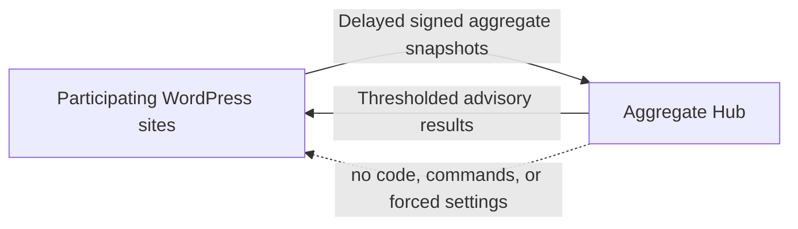

# atshift Semantic Deterrence

**An open WordPress experiment and aggregate service for measuring whether suspicious automated probing continues after a clear refusal.**

atshift Semantic Deterrence explores a narrow Agentic Web governance question: when a site returns an ordinary HTTP refusal together with a machine-readable policy state and a natural-language recommendation to stop, is continued probing observed less often?

The project does not identify visitors as AI. It classifies a bounded set of suspicious request patterns and measures whether the same local source series was observed probing again during a follow-up window. Results are described as **"no continuation observed after the warning"**. They are not described as an attack being stopped, an AI being detected, or an intrusion being prevented.

This layer does not replace a WAF, CDN rule, rate limit, authentication control, access policy, or server hardening.

## Repository

- [`wordpress-plugin/`](wordpress-plugin/) contains the installable WordPress plugin.
- [`aggregate-hub/`](aggregate-hub/) contains the small PHP/MySQL aggregate service.
- [`docs/screenshots/`](docs/screenshots/) contains public English admin screenshots.

The Hub is intentionally modest: opted-in sites send delayed pseudonymous aggregate snapshots; every client may read thresholded cross-site results. It does not distribute executable code, force a response choice, change local settings, or issue blocking commands.



## Screenshots

### Overview


### Dashboard


### Settings


## What We Are Testing

- Whether suspicious probing continues after a generic `403` response.
- Whether one of five fixed semantic response variants changes the observed non-continuation rate.
- Whether consistently returning one response differs from using a predetermined sequence for repeated probes.
- Whether useful comparisons can be shared without centrally collecting raw requests.
- Where false positives occur and which exclusions are needed before broader deployment.

The response catalog stays bounded so results remain comparable. New response hypotheses should enter through an explicit versioned experiment, not arbitrary per-site text.

## Consent And Privacy

Observation-only is the default. Deterrence, experiment participation, aggregate sharing, and aggregate readback are independent choices presented in the plugin.

Local event records omit raw request bodies, cookies, authorization headers, query values, full URLs, raw IP addresses, raw User-Agent values, domains, site names, and WordPress user data.

Sharing is off by default. An opted-in site sends aggregate counts and experimental dimensions with a random installation pseudonym. The Hub stores a server-side HMAC of that pseudonym and binds it to one independently issued site credential. Shared data is therefore accurately described as **pseudonymous aggregate data**, not unlinkable anonymous data.

The Hub rejects IP, URL, path, query, domain, host, cookie, body, User-Agent, and email fields. It also accepts only the fixed response catalog and a closed aggregate schema. Public rows remain hidden until configured minimum site and event counts are met.

## Load And Integrity

- Sites send delayed daily snapshots inside a deterministic jitter window.
- One independently generated Hub key is issued per participating site.
- A new upload atomically replaces that site's previous active snapshot, preventing overlapping daily windows from being counted repeatedly.
- Upload and revocation limits are enforced per key.
- Aggregate reads use generation-bound database caching and HTTP revalidation.
- Retention cleanup is a bounded CLI task, never work triggered by public GET requests.

## Install The Plugin

Build or download a release ZIP whose root folder is `atshift-semantic-deterrence`, then install it through WordPress. Source installation can use `wordpress-plugin/` directly as that plugin folder.

Open **Semantic Deterrence > Overview**, complete the consent guide, and keep **Observe this site only** selected while reviewing initial classifications.

Requirements: WordPress 6.4 or later and PHP 7.4 or later.

See [the plugin README](wordpress-plugin/README.md) for operating modes, response variants, languages, and development details.

Public GitHub Releases include a WordPress-ready ZIP and its SHA-256 checksum. Installed copies check the latest release at most once every six hours and only offer packages whose checksum asset is present. Future version tags automatically build these assets through GitHub Actions.

## Run The Aggregate Hub

The Hub targets a simple PHP 8 and MySQL deployment. Serve only `aggregate-hub/public/`, keep the real PHP configuration outside the public document root, import `aggregate-hub/schema.sql`, issue one random credential per site, and schedule `aggregate-hub/tools/cleanup.php`.

See [the Hub README](aggregate-hub/README.md) for endpoints, signing, privacy fields, schema installation, and maintenance.

## Contributing

Pull Requests and discussions are welcome, especially for:

- Reproducible false-positive cases and narrow classification improvements.
- Better fixed-text versus predetermined-sequence experiment designs.
- Statistical methods that communicate uncertainty and sample size honestly.
- Privacy-preserving aggregation and anti-poisoning controls.
- Cloudflare and web-server adapters that preserve local operator control.
- Accessibility, localization, and dashboard clarity.

Please state what a proposal tests, what outcome would count as evidence, possible confounders, and what data it requires. Changes that silently expand collection, identify visitors as AI, overclaim outcomes, or let the Hub control local execution are out of scope.

Only test sites and infrastructure you own or have explicit permission to assess.

## Development

```bash
find wordpress-plugin aggregate-hub -name '*.php' -print0 | xargs -0 -n1 php -l
php aggregate-hub/tests/run.php
for po in wordpress-plugin/languages/*.po; do msgfmt --check-format --check-header -o /dev/null "$po"; done
```

## Security

Please use [GitHub private vulnerability reporting](https://github.com/at-shift/atshift-semantic-deterrence/security/advisories/new). Do not include credentials, raw production requests, or personal data in a public issue. See [SECURITY.md](SECURITY.md).

## License

[GPL-2.0-or-later](LICENSE)
