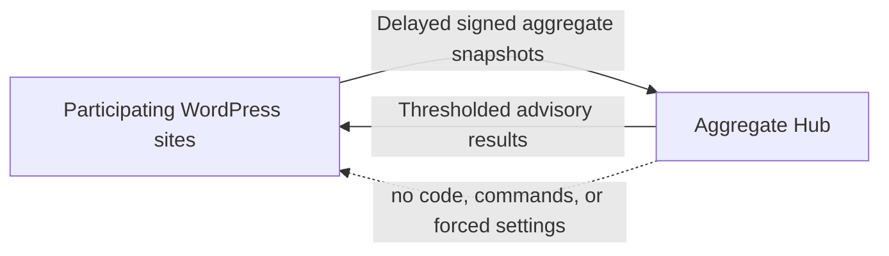

# Semantic Deterrence: An Open Experiment for the Agentic Web

**An open WordPress experiment and aggregate service for measuring whether suspicious automated probing continues after a clear refusal.**

Semantic Deterrence explores a narrow Agentic Web governance question: when a site returns an ordinary HTTP refusal together with a machine-readable policy state and a natural-language recommendation to stop, is continued probing observed less often?

## Why This Experiment Exists

Websites are routinely explored for exposed files, administration surfaces, backup archives, traversal paths, and other possible weaknesses. Much of this activity is conventional automation that will never interpret a message. Increasingly, however, an AI agent may be involved in choosing the next request, evaluating a response, or deciding whether continued exploration is useful.

That distinction suggests a testable idea. An ordinary `403 Forbidden` tells an HTTP client that access was refused, but gives a decision-making agent little explicit context. If the response also states, in machine-readable and natural-language form, that the site has recognized the probing pattern, that access is not authorized, and that continued exploration is unlikely to be useful, might an agent choose to stop?

We do not yet know. That uncertainty is the reason for this open Web experiment.

Participating sites compare a generic `403` control with a small, fixed catalog of semantic responses and then measure whether suspicious probing was observed again during a defined follow-up window. No individual site can answer the question reliably from a handful of events. By contributing privacy-bounded aggregate results, many independently operated sites can build a more useful evidence base about which responses appear effective, ineffective, or still uncertain.

If you operate a WordPress site and are comfortable joining an early research pilot, please consider participating in the experiment and contributing aggregate statistics. Participation is optional, sharing is separately opt-in, and aggregate results can be read without contributing data. Useful experiment designs, statistical methods, response hypotheses, false-positive reports, translations, and privacy improvements are also welcome through Pull Requests and discussions.

The project does not identify visitors as AI. It classifies a bounded set of suspicious request patterns and measures whether the same local source series was observed probing again during a follow-up window. Results are described as **"no continuation observed after the warning"**. They are not described as an attack being stopped, an AI being detected, or an intrusion being prevented.

This layer does not replace a WAF, CDN rule, rate limit, authentication control, access policy, or server hardening.

## Repository

- [`wordpress-plugin/`](wordpress-plugin/) contains the installable WordPress plugin.
- [`aggregate-hub/`](aggregate-hub/) contains the small PHP/MySQL aggregate service.
- [`docs/screenshots/`](docs/screenshots/) contains public English admin screenshots.

The Hub is intentionally modest: opted-in sites send delayed pseudonymous aggregate snapshots; every client may read thresholded cross-site results. It does not distribute executable code, force a response choice, change local settings, or issue blocking commands.



## Screenshots

### Overview


### Dashboard


### Settings


## What We Are Testing

- Whether suspicious probing continues after a generic `403` response.
- Whether one of five fixed semantic response variants changes the observed non-continuation rate.
- Whether consistently returning one response differs from using a predetermined sequence for repeated probes.
- Whether useful comparisons can be shared without centrally collecting raw requests.
- Where false positives occur and which exclusions are needed before broader deployment.

The response catalog stays bounded so results remain comparable. New response hypotheses should enter through an explicit versioned experiment, not arbitrary per-site text.

## Data Sharing Scope And Use

Observation-only is the default. Deterrence, experiment participation, aggregate sharing, and aggregate readback are separate choices. No experiment measurement data leaves the site unless aggregate sharing is explicitly enabled. Reading shared results can be enabled without contributing local results. Separately, normal WordPress update checks may contact the public GitHub Releases API to discover plugin updates.

An opted-in site sends delayed aggregate rows containing only:

- A random installation pseudonym and schema, plugin, and policy versions.
- The fixed response variant, experiment arm, response catalog ID, response fingerprint, and HTTP status.
- A bounded detection category and confidence level, outcome, follow-up time bucket, and observation date.
- Aggregate event and follow-up counts for that combination.

The aggregate payload does **not** contain raw or hashed IP addresses, local source HMACs, URLs, paths, queries, domains, site names, administrator details, cookies, authorization data, request bodies, form values, email addresses, raw User-Agent strings, WordPress user data, or local detailed logs. The Hub rejects fields outside its closed schema. The stable installation pseudonym is HMACed again by the Hub and bound to one site credential, so this is accurately described as **pseudonymous aggregate data**, not unlinkable anonymous data.

The Hub operator uses accepted rows to deduplicate site snapshots, enforce privacy thresholds, detect malformed or abusive submissions, calculate cross-site comparisons, and operate the service. Thresholded JSON results may be read by plugin clients and by anyone who accesses the public aggregate endpoints. They may show sample sizes, observed non-continuation rates, category and experiment-arm comparisons, and the response currently estimated to perform best. Default publication thresholds are 10 distinct sites and 100 events; a deployment may use stricter thresholds.

The intended uses are evaluating the experiment, improving its design, discussing response hypotheses, finding false-positive patterns, and publishing uncertainty-aware aggregate analysis. The project does not use shared data to identify visitors or participating domains, rank individual sites, build advertising profiles, sell leads, or remotely control a site. Aggregate readback contains no executable code, blocking command, forced setting, or automatic policy change. A local administrator must decide whether to change a response. Because aggregate endpoints are public, the project cannot technically prevent third parties from retaining or reusing already published thresholded results; this is one reason site-level and visitor-level data are excluded from public output.

The current Hub treats each upload as that site's latest bounded 30-day snapshot and replaces the prior active snapshot. Site-scoped event rows are removed after 90 days by scheduled cleanup. A signed revocation deletes the site's stored batches, clears generated aggregate caches, and retains a keyed revocation marker to reject later uploads for that site identity. Revocation cannot recall aggregate JSON already downloaded by others or analysis already published from earlier thresholded results.

As with any HTTPS service, the Hub's hosting and network infrastructure may observe transport metadata such as the connecting server IP address and request time in operational logs. That metadata is not accepted as an experiment field or included in aggregate result rows. Operators should document and minimize infrastructure-log retention separately.

See [the plugin README](wordpress-plugin/README.md#aggregate-sharing) and [the Hub privacy boundary](aggregate-hub/README.md#privacy-boundary) for implementation details.

## Data Use And Publication

Participants can retrieve the currently available, thresholded cross-site statistics whenever the aggregate service is operating. Contributing data is not required for read access, and the Hub does not give the project operator or selected participants exclusive access. Readback is limited to published aggregate JSON; it never provides another site's rows, installation pseudonym, credentials, transport logs, or raw request data.

The project operator will not turn the collected Hub data into an academic paper or reserve first publication for itself. The purpose of collecting the data is to create shared evidence that site operators and the wider community can inspect and use while this Web experiment evolves.

Participants and other readers may, without prior permission, analyze, summarize, compare, visualize, quote, republish, or present the published aggregate results. This includes use in websites, reports, articles, talks, conference presentations, teaching materials, and proposals for later experiments. The same freedom applies to the project maintainers when publishing operational summaries or experiment updates.

Any publication or presentation should identify Semantic Deterrence as the source, include the retrieval date and relevant schema or policy version when available, show sample sizes and uncertainty, and preserve the project's careful outcome language. A result may be described as **"no continuation observed after the warning"**; it must not be presented as proof that an AI agent was identified, an attack was stopped, or a vulnerability was absent. Published aggregates must not be combined with other information in an attempt to re-identify a visitor or participating site.

Aggregate results can change as new snapshots arrive, old rows expire, sites revoke participation, privacy thresholds are applied, or the experiment schema evolves. Anyone relying on the data should retain the exact JSON or a dated export used for their analysis and clearly distinguish a historical snapshot from the current Hub view.

## Load And Integrity

- Sites send delayed daily snapshots inside a deterministic jitter window.
- One independently generated Hub key is issued per participating site.
- A new upload atomically replaces that site's previous active snapshot, preventing overlapping daily windows from being counted repeatedly.
- Upload and revocation limits are enforced per key.
- Aggregate reads use generation-bound database caching and HTTP revalidation.
- Retention cleanup is a bounded CLI task, never work triggered by public GET requests.

## Install The Plugin

Build or download a release ZIP whose root folder is `atshift-semantic-deterrence`, then install it through WordPress. Source installation can use `wordpress-plugin/` directly as that plugin folder.

Open **Semantic Deterrence > Overview**, complete the consent guide, and keep **Observe this site only** selected while reviewing initial classifications.

Requirements: WordPress 6.4 or later and PHP 7.4 or later.

See [the plugin README](wordpress-plugin/README.md) for operating modes, response variants, languages, and development details.

Public GitHub Releases include a WordPress-ready ZIP and its SHA-256 checksum. Installed copies check the latest release at most once every six hours and only offer packages whose checksum asset is present. Future version tags automatically build these assets through GitHub Actions.

## Run The Aggregate Hub

The Hub targets a simple PHP 8 and MySQL deployment. Serve only `aggregate-hub/public/`, keep the real PHP configuration outside the public document root, import `aggregate-hub/schema.sql`, issue one random credential per site, and schedule `aggregate-hub/tools/cleanup.php`.

See [the Hub README](aggregate-hub/README.md) for endpoints, signing, privacy fields, schema installation, and maintenance.

## Contributing

Pull Requests and discussions are welcome, especially for:

- Reproducible false-positive cases and narrow classification improvements.
- Better fixed-text versus predetermined-sequence experiment designs.
- Statistical methods that communicate uncertainty and sample size honestly.
- Privacy-preserving aggregation and anti-poisoning controls.
- Cloudflare and web-server adapters that preserve local operator control.
- Accessibility, localization, and dashboard clarity.

Please state what a proposal tests, what outcome would count as evidence, possible confounders, and what data it requires. Changes that silently expand collection, identify visitors as AI, overclaim outcomes, or let the Hub control local execution are out of scope.

Only test sites and infrastructure you own or have explicit permission to assess.

## Development

```bash
find wordpress-plugin aggregate-hub -name '*.php' -print0 | xargs -0 -n1 php -l
php aggregate-hub/tests/run.php
for po in wordpress-plugin/languages/*.po; do msgfmt --check-format --check-header -o /dev/null "$po"; done
```

## Security

Please use [GitHub private vulnerability reporting](https://github.com/at-shift/atshift-semantic-deterrence/security/advisories/new). Do not include credentials, raw production requests, or personal data in a public issue. See [SECURITY.md](SECURITY.md).

## License

[GPL-2.0-or-later](LICENSE)
