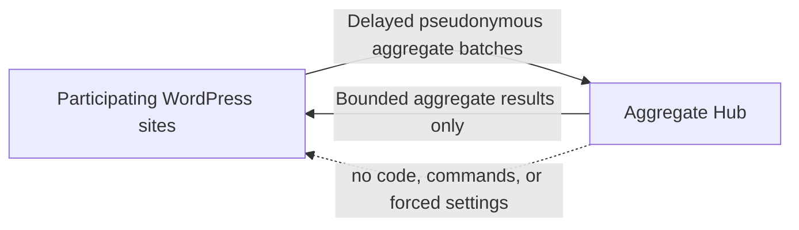

# Semantic Deterrence: An Open Experiment for the Agentic Web

**A WordPress research plugin for measuring whether suspicious automated probing continues after a clear, machine-readable refusal.**

Semantic Deterrence explores a small but useful question for the agentic web: when a site returns an ordinary HTTP refusal together with an explicit policy statement and a natural-language recommendation to stop, does the observed probing behavior change?

## Why This Experiment Exists

Websites are routinely explored for exposed files, administration surfaces, backup archives, traversal paths, and other possible weaknesses. Conventional automated tools will not understand a warning, but an AI agent involved in selecting the next request may be able to interpret both machine-readable policy state and natural-language context.

This leads to a deliberately modest hypothesis: if a site clearly states that probing has been recognized, access is not authorized, and continued exploration is unlikely to be useful, a decision-making agent may choose not to continue. We do not know whether this works, how often it works, or which wording matters. The plugin exists to test those questions rather than assume the answers.

Participating sites compare a generic `403` control with a fixed response catalog and measure whether suspicious probing was observed again during a defined follow-up window. Site owners may keep all measurements local, read cross-site aggregate results without contributing, or separately opt in to sharing privacy-bounded aggregate statistics.

If you operate a WordPress site and are comfortable joining an early research pilot, please consider participating. A useful evidence base requires observations from many independently operated sites. Pull Requests and discussions proposing response hypotheses, experiment designs, statistical methods, false-positive cases, translations, and privacy improvements are also welcome.

The plugin does not identify visitors as AI. It classifies a narrow set of suspicious request patterns, returns an optional fixed-catalog response, and measures whether probing from the same local source identity was observed again during the follow-up window. Results are described precisely as **"no continuation observed after the warning"**. They are not described as an attack being stopped, an AI being detected, or an intrusion being prevented.

This is an additional semantic-friction layer. It does not replace a WAF, CDN rule, rate limit, authentication control, or server hardening.

## Screenshots

### Overview


### Dashboard


### Settings


## What This Experiment Tests

- Whether suspicious probing continues after a generic `403` response.
- Whether one of five fixed semantic response variants changes the observed non-continuation rate.
- Whether consistently returning one response differs from using a predetermined response sequence for repeated probes.
- Whether results remain useful across participating sites without collecting raw requests centrally.
- Where false positives occur and which exclusions or classification rules are needed before broader deployment.

The response catalog is intentionally bounded. Arbitrary custom warning text would make cross-site comparisons difficult and could create an ever-growing set of statistically weak variants.

## Operating Modes

- **Observe this site only** records local aggregate events and does not change HTTP responses. This is the default.
- **Deter on this site** returns the selected semantic response for high-confidence classifications.
- **Deter and temporarily limit on this site** can return `429` after continuation is observed.
- **Participate in the experiment while deterring on this site** assigns a fixed experiment strategy, compares the generic `403` control with the five semantic responses, and can share aggregate results when sharing is separately enabled.

Deterrence, experiment participation, aggregate sharing, and aggregate readback each require an explicit choice. Experiment assignment is locked after the experiment starts and becomes selectable again only after local experiment data is deleted; deletion also returns the plugin to observation mode.

## Response Catalog

1. Policy notice
2. Detection and local-recording notice
3. Low-utility-of-continuation notice
4. Machine-readable notice
5. Combined notice

Experiments also include a generic `403` control without a semantic response body. The plugin says that a request was recorded or rate-limited only when those behaviors are actually enabled.

## Local Measurement

The plugin currently classifies high-confidence probes for sensitive configuration files, backup archives, version-control paths, unrelated administration surfaces, traversal-like paths, repeated `404` requests, method anomalies, and administrator-defined path prefixes.

Local event records contain bounded categorical and experimental fields, response fingerprints, HTTP status, follow-up counts, outcome, policy version, and keyed local identifiers. When an administrator explicitly enables the Cloudflare reference-data adapter, they may also contain the two-character country or region code reported by `CF-IPCountry`. Raw IP addresses, full URLs, query values, cookies, request bodies, authorization headers, raw User-Agent values, domains, site names, and WordPress user data are not written to the event table.

Local source identity still derives from the server-observed `REMOTE_ADDR`; the optional country code never affects classification, response selection, throttling, or source identity. The dashboard presents hourly and country or region observations as local reference data, not as experiment outcomes or proof of an attacker's location. A proxy or VPN exit may be shown instead. The country-code adapter is off by default and should be enabled only when the site is known to be behind Cloudflare.

## Aggregate Sharing

Sharing is off by default. No experiment measurement data leaves the site unless a WordPress administrator explicitly enables aggregate sharing. A site may separately enable aggregate readback without contributing its own data. Normal WordPress update checks may contact the public GitHub Releases API independently of experiment sharing.

When sharing is enabled, the plugin sends delayed daily batches within a site-specific jitter window. A shared row contains a random installation pseudonym; schema, plugin, and policy versions; fixed response and experiment dimensions; a response fingerprint and HTTP status; a bounded detection category and level; outcome, follow-up bucket, and observation date; and aggregate event and follow-up counts.

Shared rows do **not** contain raw or hashed IP addresses, local source HMACs, country or region codes, hourly reference statistics, URLs, paths, queries, cookies, authorization data, request bodies, form values, domains, site names, administrator details, visitor identifiers, email addresses, raw User-Agent strings, WordPress user data, or local detailed logs. Because the installation pseudonym is stable and the Hub binds its server-side HMAC to one site credential, this data is accurately described as **pseudonymous aggregate data**, not unlinkable anonymous data.

The Hub uses accepted rows to replace overlapping site snapshots, enforce privacy thresholds, detect malformed or abusive submissions, and calculate cross-site comparisons. Thresholded aggregate JSON is available to clients and other readers of the public endpoints whether or not they contribute experiment data. The Dashboard shows each published response and experiment arm with its site count, sample size, observed outcomes, non-continuation rate, and difference from the matching generic 403 control. Default publication thresholds are 10 distinct sites and 100 events.

The intended uses are experiment evaluation, improved experimental design, false-positive analysis, response-hypothesis discussion, and uncertainty-aware aggregate reporting. The project does not use shared data to identify visitors or domains, rank participating sites, create advertising profiles, sell leads, or remotely control a site. Readback cannot send executable code, force a response, change local settings, or issue a blocking command. Because aggregate endpoints are public, the project cannot technically prevent third parties from retaining or reusing thresholded results that have already been published.

Each upload is treated as the site's latest bounded 30-day snapshot. Hub event rows are removed after 90 days by scheduled cleanup. A signed revocation deletes that site's stored batches and clears generated caches while retaining a keyed revocation marker that prevents later uploads for the revoked identity. Results already downloaded or incorporated into published aggregate analysis cannot be recalled.

The HTTPS connection itself exposes ordinary transport metadata, such as the connecting server IP and request time, to the Hub's hosting and network infrastructure. This metadata is not part of the experiment payload or aggregate result schema. See [the repository data-sharing section](../README.md#data-sharing-scope-and-use) and [the Hub privacy boundary](../aggregate-hub/README.md#privacy-boundary).

## Data Use And Publication

Participants can retrieve the currently available, thresholded aggregate statistics whenever the Hub is operating. Read access does not require contributing local data. It provides cross-site aggregate JSON only, never another site's rows, installation pseudonym, credentials, transport logs, or raw requests.

The project operator will not use the collected Hub data to produce an academic paper or reserve first publication for itself. Participants, maintainers, and other readers may analyze, summarize, compare, visualize, quote, republish, or present the published aggregate results without prior permission. Possible uses include websites, reports, articles, talks, conference presentations, teaching materials, and proposals for future experiments.

Public use should identify Semantic Deterrence as the source, include the retrieval date and relevant schema or policy version, report sample size and uncertainty, and preserve the wording **"no continuation observed after the warning"**. Aggregate results must not be represented as proof that an AI agent was identified, an attack was stopped, or a vulnerability was absent, and they must not be combined with other data in an attempt to re-identify a visitor or site.

The current Hub view may change when new data arrives, rows expire, a site revokes participation, thresholds apply, or the schema changes. Retain a dated JSON export when reproducibility matters.



## Current Safeguards

- Observation-only default and independent opt-ins.
- Fixed response catalog and high-confidence response threshold.
- Local exclusions for paths and source addresses.
- Daily rotating measurement identifiers and a separate stable experiment assignment key.
- Database-atomic per-source duplicate suppression and site-wide write budgets.
- Thirty-day local retention for event rows.
- HTTPS-only Hub communication by default, with no redirects and bounded response sizes.
- HMAC-signed batch uploads with timestamp and nonce headers.
- Schema-validated, normalized Hub readback with no remote-control fields.

This is research software in an early pilot. Review classifications locally before enabling response changes, keep an independent WAF in place, and report unexpected classifications.

## Installation

1. Download a release ZIP, or place the contents of `wordpress-plugin/` in `wp-content/plugins/atshift-semantic-deterrence`.
2. Activate **atshift Semantic Deterrence** in WordPress.
3. Open **Semantic Deterrence > Overview** and complete the three-step consent guide.
4. Keep **Observe this site only** selected while reviewing local detections.
5. Enable deterrence, experiment participation, sharing, or readback only after reviewing the relevant boundaries.

Requirements: WordPress 6.4 or later and PHP 7.4 or later.

After installation, WordPress checks the public GitHub Releases feed for newer versions. Release packages are installed only after their accompanying SHA-256 checksum is verified.

## Languages

The plugin includes Japanese, English (US), Spanish, German, French, Brazilian Portuguese, Italian, Russian, Dutch, Simplified Chinese, Polish, Turkish, Indonesian, Traditional Chinese (Taiwan), and Korean translations.

## Contributing Experiments

Interesting ideas are welcome as Pull Requests or GitHub discussions. Particularly useful contributions include:

- A clearly stated response hypothesis that can fit a bounded comparison catalog.
- Better experimental designs for fixed text versus predetermined sequences.
- Statistical methods that communicate uncertainty and minimum sample sizes honestly.
- Reproducible false-positive cases and narrowly scoped classification improvements.
- Privacy-preserving aggregation proposals.
- Trusted adapters for Cloudflare and web-server enforcement layers.
- Accessibility, localization, and dashboard clarity improvements.

Please describe what a proposal intends to test, what outcome would count as evidence, possible confounders, and what data it requires. Changes that silently expand collection, identify visitors as AI, overclaim outcomes, or let the Hub control local execution are out of scope.

## Development

The plugin is intentionally dependency-light. Before opening a Pull Request:

```bash
find . -name '*.php' -print0 | xargs -0 -n1 php -l
for po in languages/*.po; do msgfmt --check-format --check-header -o /dev/null "$po"; done
```

Test observation and deterrence behavior in an isolated WordPress environment. Do not probe systems you do not own or have explicit permission to test.

## Security

Please report vulnerabilities through [GitHub private vulnerability reporting](https://github.com/at-shift/atshift-semantic-deterrence/security/advisories/new). See [SECURITY.md](../SECURITY.md) for scope and handling guidance.

## License

[GPL-2.0-or-later](../LICENSE)
